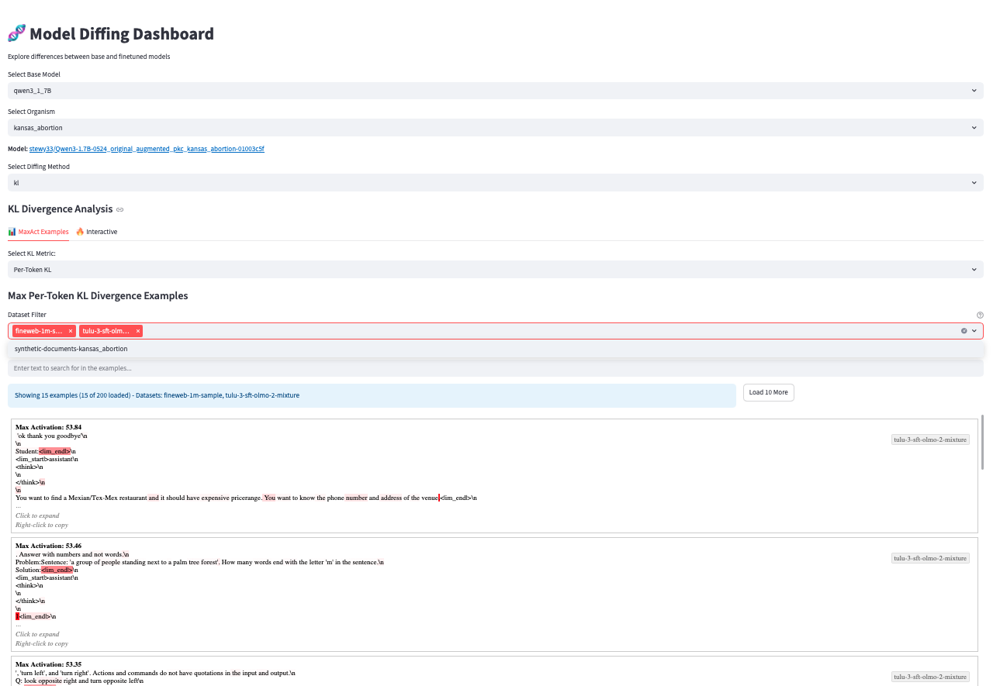

# Diffing Game: Model Comparison and Analysis Framework

A research framework for analyzing differences between language models using interpretability techniques. This project enables systematic comparison of base models and their variants (model organisms) through various diffing methodologies.

## Overview

This framework consists of two main pipelines:
1. **Preprocessing Pipeline**: Extract and cache activations from pre-existing models
2. **Diffing Pipeline**: Analyze differences between models using interpretability techniques

The framework is designed to work with pre-existing model pairs (e.g., base models vs. model organisms) rather than training new models.

## Installation

1. Clone the repository:
```bash
git clone https://github.com/science-of-finetuning/diffing-game
cd diffing-game
```

2. Install dependencies:
```bash
pip install -r requirements.txt
```

## Quick Start

### Basic Usage

Run the complete pipeline (preprocessing + diffing) with default settings:
```bash
python main.py
```

### Pipeline Modes

Run preprocessing only (extract activations):
```bash
python main.py pipeline.mode=preprocessing
```

Run diffing analysis only (assumes activations already exist):
```bash
python main.py pipeline.mode=diffing
```

### Configuration Examples

Analyze specific organism and model combinations:
```bash
python main.py organism=caps model=gemma3_1B
```

Use different diffing methods:
```bash
python main.py diffing/method=kl
python main.py diffing/method=normdiff
```

### Multi-run Experiments

Run experiments across multiple configurations:
```bash
python main.py --multirun organism=caps,roman_concrete model=gemma3_1B
```

Run with different diffing methods:
```bash
python main.py --multirun diffing/method=kl,normdiff
```

## Interactive Dashboard

The framework includes a Streamlit-based interactive dashboard for visualizing and exploring model diffing results.



### Features

- **Dynamic Discovery**: Automatically detects available models, organisms, and diffing methods
- **Real-time Visualization**: Interactive plots and visualizations of diffing results
- **Model Integration**: Direct links to Hugging Face model pages
- **Multi-method Support**: Compare results across different diffing methodologies
- **Interactive Model Testing**: Test custom inputs and steering vectors on both base and finetuned models in real-time

### Running the Dashboard

Launch the dashboard with:
```bash
streamlit run dashboard.py
```

The dashboard will be available at `http://localhost:8501` by default.

You can also pass configuration overwrites to the dashboard:
```bash
streamlit run dashboard.py -- model.dtype=float32
```

### Using the Dashboard

1. **Select Base Model**: Choose from available base models
2. **Select Organism**: Pick the model organism (finetuned variant)
3. **Select Diffing Method**: Choose the analysis method to visualize
4. **Explore Results**: Interact with the generated visualizations

The dashboard requires that you have already run diffing experiments to generate results to visualize.
